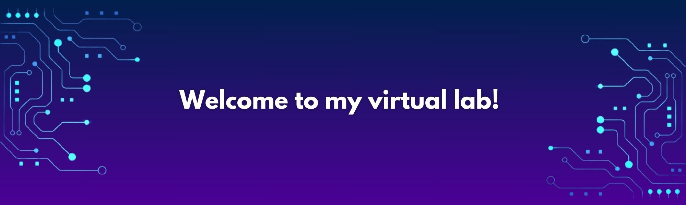

## Hello! 🪐👩🏻‍💻
I am a Systems Engineering student 👾✨  
Here, you can find the projects I have worked on so far, and I will continue to share new ones as I complete them. 
I want to track my progress as a Software Engineer, which is why I'll keep the small college projects and online courses I've completed before.
My goal is to make this process accessible to others by documenting it visually and writing efficient code.  
📌 I am currently building an e-commerce website, includes functionalities like a login, add to cart, create orders, accepting payments via Stripe, and finally publishing it to Heroku.
The technologies used to develop this project are C#, .NET, Entity, React, TypeScript, among others.  
📌 Also, you can take a look at Ethos, my collaborative graduation project from 4GeeksAcademy  
  

## 🌈💻 Tech Stack:

## 👋🏻 Socials:
 

## 🐱⚗️ Fun fact:
I enjoy learning about science and technology, especially about mathematical principles underlying programming logic.

## ⚡ GitHub Stats:
 
 

<!-- Proudly created with GPRM ( https://gprm.itsvg.in ) -->
